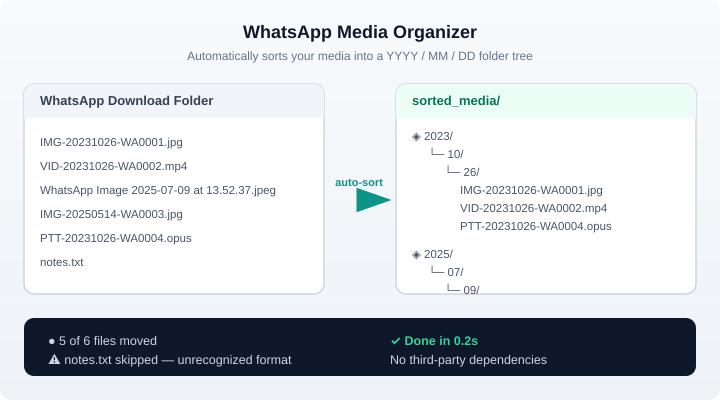

# WhatsApp Media Organizer

[](https://github.com/OWNER/whatsapp-media-organizer/actions)
[](https://github.com/OWNER/whatsapp-media-organizer/releases)
[](https://www.python.org/downloads/)
[](LICENSE)
[]()

Sort your WhatsApp media (images, videos, voice notes) into a clean `YYYY/MM/DD`
folder tree automatically — with a CLI, a desktop GUI, and pre-built binaries for
Windows, macOS, and Linux.

## Demo



WhatsApp files use two naming formats; both are recognized:

| Format | Example |
| --- | --- |
| Legacy | `IMG-20231026-WA0001.jpg` |
| Export | `WhatsApp Image 2025-07-09 at 13.52.37.jpeg` |

## Features

- Sorts into `YYYY/MM/DD` folders from the date embedded in each filename
- Handles both WhatsApp naming formats automatically
- `--dry-run` preview mode — see what would move before moving anything
- Collision handling: renames duplicates (e.g. `photo_1.jpg`), or skips with `--no-rename`
- Skips files with unrecognized names or impossible dates without touching them
- Pure standard library — no third-party dependencies
- Cross-platform: Windows, macOS, Linux
- Desktop GUI (tkinter) plus a full-featured CLI
- Works offline

## Installation

### Option 1: Pre-built binaries (recommended)

Grab the latest release for your platform from the
[Releases page](https://github.com/OWNER/whatsapp-media-organizer/releases):

- **Windows** → `WhatsAppMediaOrganizer-Windows.exe` (double-click to launch the GUI)
- **macOS** → `WhatsAppMediaOrganizer-macOS` (DMG) — right-click → Open to bypass Gatekeeper on first run
- **Linux** → `WhatsAppMediaOrganizer-Linux`

### Option 2: Install from source with pip

```bash
python -m pip install git+https://github.com/OWNER/whatsapp-media-organizer.git
```

## Usage

### Command line

```bash
whatsapp-media-organizer --source ~/Downloads/WhatsApp --dest ~/sorted
```

Options:

| Option | Description |
| --- | --- |
| `-s, --source` | Directory containing the WhatsApp media files (**required**) |
| `-d, --dest` | Destination root (default: `~/Desktop/sorted_media`) |
| `--no-rename` | Skip files that would overwrite an existing target instead of renaming |
| `--dry-run` | Show what would be moved without touching the filesystem |
| `--version` | Print the version and exit |

Preview before you commit:

```bash
whatsapp-media-organizer --source ~/Downloads/WhatsApp --dry-run
```

### Graphical interface

Run the GUI from the source tree:

```bash
python -m whatsapp_media_organizer.gui
```

or launch the packaged binary from the Releases page. Pick the source folder,
pick a destination (defaults to `~/Desktop/sorted_media`), and press
**Start Organizing**.

### As a library

```python
from whatsapp_media_organizer import organize_whatsapp_media

result = organize_whatsapp_media("/path/to/downloads", "/path/to/sorted")
print(f"Moved {result.moved} of {result.total} files.")
```

## How it works

1. Every file in the source folder is checked against known WhatsApp naming
   patterns.
2. The embedded date is validated (impossible dates like `02/30` are rejected).
3. Files are moved to `DEST/YYYY/MM/DD/`, creating folders as needed.
4. If a target already exists, a numeric suffix is appended (`_1`, `_2`, …)
   unless `--no-rename` is set.

## Development

```bash
python -m pip install -e ".[test]"
python -m pytest
```

See [CONTRIBUTING.md](CONTRIBUTING.md) for the contribution workflow, and
[CHANGELOG.md](CHANGELOG.md) for release history.

## Security

See [SECURITY.md](SECURITY.md) for supported versions and how to report a
vulnerability.

## License

[MIT](LICENSE) © WhatsApp Media Organizer contributors
